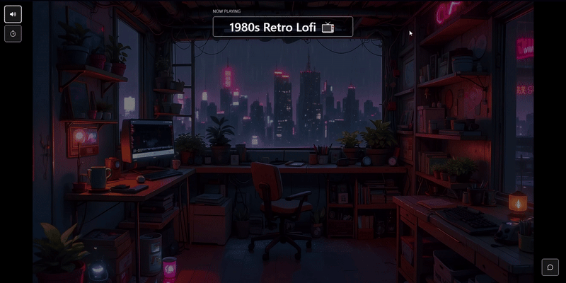

# 🎵 FocusFlow – React Lofi Music & Focus App

FocusFlow is a comprehensive lofi music and productivity application developed using React and Tailwind CSS, powered by a robust Node.js backend with MongoDB. Experience the ultimate focus environment with music, timers, real-time collaboration, and ambient sounds.

---

## ✨ Features

### 🎧 Advanced Music System
- 🎵 **Multi-category Lofi Stations** (Cafe, Night, Rain, Study, Chill, Jazz)
- 🔍 **Smart Search** by title, artist, or category
- 📊 **Station Details** with audio information and metadata
- ⭐ **Favorites System** with persistent storage
- 🔊 **Audio Controls** play, pause, volume, and progress

### 🎯 Complete Productivity Suite
- ⏰ **Advanced Pomodoro Timer** with customizable intervals
- 📈 **Focus Statistics** and session history
- 🎚️ **Sound Mixer** separate controls for music and ambient sounds
- 🎨 **Live Backgrounds** dynamic visual experiences
- ⏱️ **Session Tracking** with progress monitoring

### 👥 Real-time Collaboration
- 💬 **Live Chat Rooms** for group study sessions
- 👥 **User Presence** see who's online in rooms
- 🔔 **Real-time Notifications** for messages and events
- 🏠 **Multiple Rooms** join different focus environments

### 🔐 User Management
- 👤 **Complete Authentication** login/register system
- 📱 **User Profiles** with personal statistics
- ⚙️ **Settings Panel** customize your experience
- 🔒 **Secure Sessions** with JWT tokens

### 🛠️ Developer Features
- 📚 **Swagger UI** complete API documentation
- 🔧 **RESTful API** well-structured endpoints
- 🐳 **Docker Support** easy deployment
- 📡 **WebSocket Support** real-time features

---

## 🛠️ Technology Stack

### Frontend
- **⚛️ React 18** with Hooks and Context API
- **🎨 Bootstrap 5** + **Tailwind CSS** for responsive UI
- **🛣️ React Router** for navigation
- **⚡ Vite** for fast development
- **📡 Socket.io Client** for real-time features

### Backend
- **🟢 Node.js & Express** REST API server
- **🍃 MongoDB & Mongoose** database with optimized schemas
- **🐳 Docker** containerization
- **🔐 JWT** authentication system
- **🔌 Socket.io** real-time communication
- **📊 Swagger/OpenAPI** automated documentation

### Development & Deployment
- **📚 Swagger UI** interactive API testing
- **🐳 Docker Compose** multi-service management
- **🌐 CORS** configured for cross-origin requests
- **🔧 Environment Variables** secure configuration

---

## 🖼️ Application Screenshots

### 🏠 Main Dashboard
Beautiful grid layout with categorized lofi stations, search bar, and category filters.


---

### 🎵 Station Detail Page



**Comprehensive station view featuring:**
- 🎵 **Audio Information** - bitrate, format, duration
- ⏰ **Pomodoro Timer** - customizable work/break intervals
- 💬 **Live Chat** - real-time group conversation
- 🎨 **Live Background** - dynamic visualizer
- 🔊 **Sound Controls** - music and ambient mixers
- 👥 **User List** - see who's listening

---

### ⏰ Pomodoro Timer
Advanced timer with:
- ⏱️ Customizable intervals (25/5, 50/10, custom)
- 📊 Session progress tracking
- 🔔 Break notifications
- 📈 Statistics overview

---
### 💬 Live Chat System
Real-time group chat features:
- 👥 User presence indicators
- 💬 Instant messaging
- 🔔 Message notifications
- 🏠 Multiple room support

---

### 🔐 Authentication Pages
Modern login and register forms with validation and security.


---

### 📚 Swagger API Documentation
Complete backend API documentation with interactive testing.


---

## 🐳 Docker Deployment

### Quick Start with Docker Compose
```bash
# Clone and deploy in one command
git clone https://github.com/GoktugGok/FocusFlow-Lofi-Life.git
cd FocusFlow-Lofi-Life
docker-compose up --build
